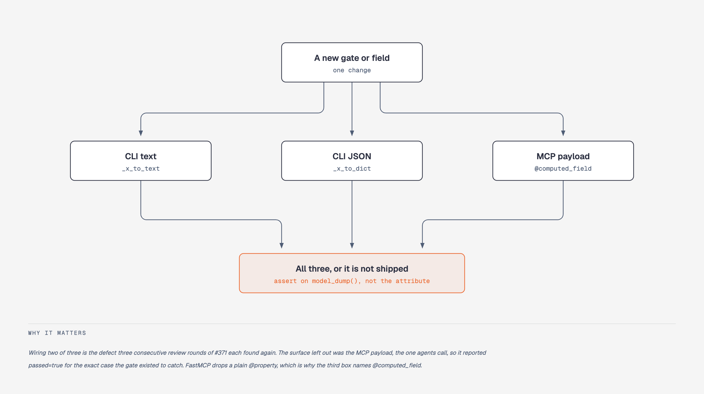

# Working on archy

Notes for a coding agent working *on* this repository. For using archy as a
tool, see [`skills/archy/SKILL.md`](skills/archy/SKILL.md) and the README.

Everything here was learned by getting it wrong. Each rule names the failure it
came from, so you can judge whether it applies to what you are doing rather than
following it blindly.

Two rules in [Git and GitHub](#git-and-github) are worth reading before you
touch anything, because both fail quietly: never push to `main` (branch and open
a PR instead), and use `gh api` REST, because `gh pr edit` and `--json` go
through GraphQL, which can fail while still exiting 0.

## Before you push: run what CI runs

```bash
uv run ruff check          # NO path argument
uv run ruff format --check
uv run ty check
uv run pytest
uv run archy check .       # archy's own layer rules
uv run archy cycles . --strict
uv run archy conventions . --emit-headers --check   # derived headers still true
```

**`ruff check` with no path.** Running `ruff check some/file.py` is not the same
command and will pass while CI fails: a fixture directory with deliberately
unused imports broke the build twice in one session because it was only ever
linted per-file.

**`archy conventions . --emit-headers --check` is a gate too.** The headers in
archy's own modules are derived, so adding a public symbol or changing a mirror
set makes them stale, and CI fails. Regenerate with `uv run archy conventions .
--emit-headers --write`; never hand-edit a block, because the next regeneration
discards the edit and the point of the block is that it is not hand-authored.

**`archy check` and `archy cycles` matter as much as `ruff check`, `ruff
format`, `ty` and `pytest`.** archy gates itself, so a new fixture tree or bench
sample can introduce a real cycle or layer violation in a directory that is not
archy's code. Add such trees to `exclude:` in `archy.yaml`
with the reason, rather than weakening a rule.

**Some failures only appear in CI's environment.** The bench caches under
`bench/cache/` are gitignored, so a test that depends on one passes locally and
fails on the runner. Before pushing a test that touches one, run
`mv bench/cache /tmp/bench-cache-aside`, re-run the test, then move it back. Assert the invariant, not the message: a test that checks *which*
precondition failed is asserting a fact about your laptop.

**Open the failing check, never the tally.** A summary line saying "1 failed"
tells you nothing; `main` has been broken by merging on a green-looking count.
Fetch the job's failing *step*, then its log.

## Adding a gate or a payload field



**Wire it to every surface in one change.** Three at the time of writing.
Confirm that is still current by picking an existing gate and grepping for
every site that renders it: its `_<cmd>_to_text` helper and `_<cmd>_to_dict` payload in
`src/archy/cli.py`, and its tool's return model in `src/archy/mcp.py`. A fourth
surface would show up as a site that none of those three patterns match. A presence check shipped to the CLI alone
left the MCP surface, the one agents actually call, reporting `passed=true` for
the exact case the check existed to catch. Three consecutive review rounds each
found one more surface it had been omitted from.

**Test the serialized form, not the attribute.** FastMCP sends `model_dump()`,
which silently drops plain `@property`. A test asserting
`payload.coverage.layers_present == 0` passed while the wire format carried
nothing at all. Use `@computed_field` for derived values that consumers need,
and assert on `model_dump()`.

**A verdict without a reason is not actionable.** `passed=false` with an empty
`violations` list is indistinguishable from a bug in archy. Whatever fails the
gate must also say why, in every format.

## Tests that cannot fail

A green suite is not evidence a test works. Sixteen tests in this repository
asserted something true regardless of whether the code was correct, and two of
them were hiding a live bug: `edit_risk`'s exponent and the DSM back-edge
predicate could both be changed with all 1,218 tests passing (#438).

**Verify a test by mutating the code it covers and checking it goes red.**
Nothing else settles it. Reading is not enough, and this is not a counsel of
perfection: five consecutive review rounds each found a test the previous round
had just declared sound, including tests written specifically to close this
class of gap. `bench/mutate.py` does it in bulk; by hand is fine for one test.

The three shapes, each of which shipped here:

- **Agreement between two things that share an implementation.** A test
  asserting `conventions --module` matches the graph became tautological the
  moment both were refactored onto one resolver (#437): break it and both break
  identically. Assert the ANSWER, not the agreement. Where cross-surface parity
  really is the property, derive the two sides independently, the way
  `test_greenfield_eval.py` shells out to the CLI on one side.
- **An expected value the code under test produced.** `project == mean(per_module)`
  was an algebraic identity of the implementation, true for every possible
  definition of reach (#439). Hand-work the number and put the arithmetic in the
  docstring.
- **A fixture that never reaches the branch.** A clamp tested on a graph whose
  value is never negative; a ranking checked where every fixture value is `0.0`,
  so it is sorted in both directions; a two-node graph where `edit_risk` is
  structurally zero. **Assert the fixture exercises the thing before asserting
  the outcome**, or the test quietly stops testing when the fixture drifts.

Two traps worth knowing before you mutate anything. **An inert mutation proves
nothing in either direction**: reversing a topological sort on a 3-cycle changes
nothing, because one SCC orders its members alphabetically, and a test that
"survives" it has not been shown to be blind. And **clear `__pycache__`**: a
reordering mutation keeps the file's byte length, so a stale `.pyc` can survive
the restore and make a clean tree report the mutated behaviour.

Remaining known cases are filed as #440, #441 and #442.

## Review findings

Reviews here regularly find real bugs, not just style. When a round finds
something substantive, run another round after fixing. `min_layers_present`
(#123, PR #371) needed four rounds, and rounds two, three and four each found a
distinct real defect: the gate missing from the MCP surface, the JSON output not
saying why it failed, and `model_dump()` dropping the reason entirely.

**Pre-existing findings get filed, not folded in.** Widening a PR to fix code it
did not touch makes the diff harder to review and buries the actual change.
Precedent, all split out of unrelated PRs and all still readable as standalone
tickets: #317 (duplicated empty-package setup in the CLI tests), #318 (the
repeated Click bound-check validations), #335 (two duplicated text-renderer
blocks in `cli.py`). **Check for an existing ticket first** - it is easy to
file a duplicate of something a contributor is already working on.

**Leave `good first issue` tickets alone.** Outside contributors pick these up;
several have landed. Filing new ones is welcome, taking them is not.

## Measurement and benches

Read [`docs/WHAT_DIDNT_WORK.md`](docs/WHAT_DIDNT_WORK.md) before proposing any
study. Every pre-registered claim measured here has come back null, and the
write-up explains what that does and does not license. The delivery line alone
now stands at **six interventions, none positive**, two of which were measured
as costing MORE than their control. A seventh idea for pushing a fact at the
model needs a reason it differs from those six.

**Build and validate the measurement before spending agent time.** Live agent
runs are the only expensive part of any bench here. Every harness bug found
during a paid run is a run wasted, and the arm-B pilot found five plumbing bugs
that would each have cost the whole batch had they not been caught by a
one-task smoke run first.

**Anything that spends agent time must checkpoint per unit and resume.** A run
is hours long, and the failure modes are ordinary: a stalled subprocess, a usage
limit, a laptop sleeping, a crash in the scorer, someone pressing Ctrl-C. Copy
the shape from `bench/_supervise.py` and `bench/q1b_run.py` rather than inventing
one, because each rule in it was paid for:

- **One ledger row per completed unit, appended with its newline in a single
  write.** Two writes leave a window where a crash merges the next row into the
  torn one and loses both.
- **Only `status="ok"` counts as done.** Rows recorded as `error` or `stalled`
  are retried on the next run, which is the safe direction.
- **Retry stalls, never results.** A non-zero exit from the agent is a real
  outcome; re-rolling it selects for runs that happened to succeed and biases
  the sample.
- **A crash in one unit must not end the loop.** Record it and continue, or one
  bad task costs a batch that has already run for hours.
- **A usage limit is not a result.** It is a fact about the account, so wait and
  retry the same unit; recording it as an outcome would put your subscription
  into the measurement.
- **Interrupts exit cleanly and say how to resume.** Everything already written
  survives; only the in-flight unit is lost.

`tests/test_q1b_run.py` pins all of this. A bench without it will eventually eat
an afternoon and produce nothing.

**Pre-register the thresholds, including the ones that kill your idea.** Write
them into the repository before running. `p_B <= 10%` and the four decay nulls
were committed in advance, which is the only reason reading them afterwards was
honest. **Do not reinterpret a threshold to keep a signal alive.**

**Pilot the control arm before you fix a threshold against it.** #369 set its
win condition at +25 pp from a control rate inferred from a paper. The measured
control rate was 88%, which caps the largest possible effect at +12, so the win
was arithmetically unreachable before the run started and the treatment scoring
a perfect 100% still could not reach it. Five control runs would have shown that
for about an hour of agent time. "Validate the measurement before spending agent
time" covers the design parameters, not just the harness.

**Audit results for artifact-shaped numbers before believing them.** A metric
that is exactly `0.0000` for every repository, or an implausibly high count, is
an artifact until proven otherwise. The decay study carried six such artifacts,
and **every one of them biased toward the answer the study wanted**: it would
have reported 57% where the truth was 11%.

**Unmeasurable runs are dropped, never scored clean.** Counting a run that could
not be analysed as a pass biases the rate by exactly the runs that broke.

**Isolate `/tmp` per run, and setting `TMPDIR` is not enough.** Agents build
reproduction fixtures at hardcoded ABSOLUTE paths (`/tmp/repro`, `/tmp/repro2`),
so they write outside whatever `TMPDIR` says. Those fixtures persist, and a
later cell finds the work already done and says so in its own reasoning: *"the
`top/` directory is a leftover from a previous evaluation session"*. Audited
across 181 archived transcripts, **42 (23%) show cross-run artifact discovery**,
rising to 43% on the most-used card, and that is a floor because it counts only
the cells that remarked on it.

This breaks repeats' independence, so `n` was never the `n` claimed, and it
biases *later* cells rather than distributing evenly. Worse, it preferentially
hands over the expensive part: building the reproduction. Quarantine `/tmp`
before each agent starts, and state whether a result is pre- or post-isolation
rather than pooling the two.

**A treatment must be verified present from the SUBJECT's record, not the
harness's intent.** One arm was void because the harness deleted its own
treatment before the agent started, while an inline guard grepped a POOLED
transcript archive and so reported the treatment present in control cells too.
Both bugs pointed the same way: toward believing the run happened. Confirm from
the model's own session (the headers arm showed 15/19/23 `archy:owns` hits in
its own transcripts; the control showed 0/0/0).

## Config and rules

**A rule set that cannot fire looks exactly like a clean codebase.** Two shipped
bench configs had patterns matching one empty `__init__.py` instead of a
338-module package, so every rule in them was dead and `check` exited 0. Layer
patterns are `pkg.**`, not `pkg`, which matches an exact dotted name.

Whenever you author rules for a codebase, **canary them**: add one deliberately
violating import, confirm exit 1, revert. `bench/q1b_layers_check.py --canary`
does this for the bench configs.

## Git and GitHub

- Branch and open a PR. Never push to `main`.
- Use `gh api` REST. `gh pr edit` and `--json` flags go through GraphQL, which
  can fail while still exiting 0.
- Merging a stacked PR with `--delete-branch` auto-closes its child, and a
  closed PR's base cannot be retargeted.
