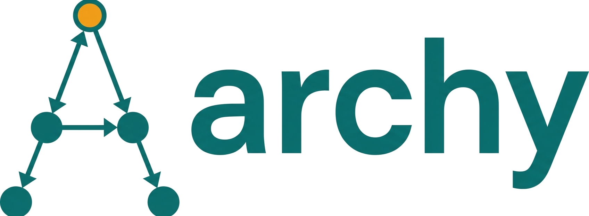

<!-- mcp-name: io.github.hslee16/archy -->

<p align="center"></p>

[](https://pypi.org/project/archy/)
[](https://pypi.org/project/archy/)
[](https://github.com/hslee16/archy/actions/workflows/ci.yml)
[](https://github.com/astral-sh/ruff)
[](LICENSE)
[](https://glama.ai/mcp/servers/hslee16/archy)

> archy holds the structure you *declared* for a Python codebase (layers, forbidden edges, no cycles, a recorded score baseline) and tells you when an edit breaks it.

## The failure it catches

I built archy after watching coding agents produce changes that passed review and rotted the import graph underneath. Every individual diff looked fine. Six weeks later the cycle count had doubled, and nobody noticed until a refactor blew up.

Here is that failure compressed into one line. This is archy's own source, under archy's own layer rules, with a single import of the kind an agent adds when it needs a helper and the nearest one is upward:

```python
# src/archy/parser.py
from archy.cli import main    # convenience import. The diff looks harmless.
```

```console
$ uvx archy check .
# 1 layer violation(s) (config: archy.yaml)

parser -> cli (forbidden):
  archy.parser -> archy.cli  (line: 9)

$ echo $?
1

$ uvx archy cycles .
# 1 cycle(s) found

Cycle of 8 module(s):
  - archy.cli
  - archy.duplicates
  - archy.graph
  - archy.index
  - archy.mcp
  - archy.parser
  - archy.simulate
  - archy.watcher

$ uvx archy score .
# archy score: 0.660          (0.669 before the edit)
...
acyclicity:  0.930  (1 cycles, tangle=0.070)
# graph: 115 modules, 244 edges     (243 before the edit)
```

One import, one edge. A forbidden layer edge, an eight-module cycle, and the score down 0.009. Nothing in the diff itself says any of that, and no amount of reading the file reveals it, because the rule that makes it a violation is not in the source. You supplied it.

Note the size of the score move. 0.009 is small, and that is the honest shape of this problem: no single edit looks alarming on the number. The cycle count going 0 to 1 and `check` exiting 1 are the signals that matter here, and the score is what catches the version of this that happens forty times over six weeks. Read [`docs/SCORING.md`](docs/SCORING.md) before treating the composite as a quality gate.

That example is a *direct* forbidden import, which is the easy case: an agent that reads `archy.yaml` first can catch it without archy. The harder and more honest case is a **transitive** violation, where the edit adds no forbidden import at all and reading the config tells you nothing. [`docs/WALKTHROUGH.md`](docs/WALKTHROUGH.md) is a one-command reproduction of that, and it states plainly which archy surfaces catch it (one) and which miss it (three).

Reproduce the example above on a checkout: add that import to `src/archy/parser.py`, then run the three commands **with the `uvx` prefix**. It has to be a separate archy, because that one import is a genuine runtime import cycle, and an editable-installed archy can no longer start to report on itself. `archy check` exits 1, which is what it does in CI and what the MCP server reports to an agent before it commits.


**What archy is not:** a code-navigation tool. It will not help an agent find and read code faster; that job belongs to symbol-level, multi-language graph tools like [codegraph](https://github.com/colbymchenry/codegraph), and they are better at it. archy answers the other question: *you declared this codebase should have these layers, no cycles, and this score; is the agent's edit about to break that, and has the trend been sliding for six weeks?* Nothing in a navigation graph carries that intent, because intent is not in the source, you supply it. The two are both local MCP servers and compose fine; run them together. See [`docs/research/CODEGRAPH_COMPETITIVE_ANALYSIS.md`](docs/research/CODEGRAPH_COMPETITIVE_ANALYSIS.md) for the full comparison, including where archy loses.

## Start in one command

```bash
uvx archy install     # detects Claude Code, Cursor, Codex, opencode, Continue and wires each one up
```

Nothing lands on your PATH: the config it writes runs `uvx archy mcp` on demand. Prefer a real install? `pip install archy`, `uv tool install archy`, or `pipx install archy`. Either way, try it on a project without installing anything:

```bash
uvx archy score .        # one-shot architectural health number
uvx archy cycles .       # import cycles, Tarjan SCCs plus self-loops
uvx archy check .        # layer rules from archy.yaml; exits 1 on violation
```

**Free, MIT licensed, no commercial version planned.** One maintainer, Python only. Built by [Alex Lee](https://github.com/hslee16/Archy).

**Status:** v0.42.0. Usable today via:

| Mode | Command |
|---|---|
| Inspection | `archy graph`, `archy cycles` |
| CI governance | `archy check` (reads `archy.yaml`) |
| Transitive contracts | `archy contracts` (reads `.importlinter` (canonical) or falls back to `archy.yaml`; requires `archy[contracts]`) |
| One-shot score | `archy score` |
| Trended score | `archy score --record` + `archy trend` |
| Refactor priority | `archy hotspots` (CC x git churn), `archy what-to-refactor-next` (fused hotspots + edit-risk) |
| Duplicate detection | `archy duplicates` (two-tier: likely duplicates vs demoted variants - same-class/boilerplate/test/vendored; advisory, not a score axis) |
| Change coupling | `archy coupling` (module pairs that co-change in git history but share no import/call edge - hidden dependencies; source-only, advisory) |
| CI impact lookup | `archy affected` (`git diff` -> impacted modules + tests, depth-capped) |
| Human-facing export | `archy render --view dsm\|trend` (one self-contained HTML file: no JS, no CDN, offline, byte-stable) |
| MCP server | `archy mcp` (cached: warm graph builds in seconds even on 10k+ module repos) |
| Parse cache | `archy index sync` / `archy index clear` (persistent `.archy/index.db`; transparent under the MCP server) |
| Agent install | `archy install` / `archy uninstall` (auto-detect Claude Code, Cursor, Codex, opencode, Continue; wire in or cleanly remove the MCP server) |

How the score is computed and how to read it: [`docs/SCORING.md`](docs/SCORING.md). Benchmarks against pydantic, fastapi, flask, pytest, and archy-on-archy: [`docs/CASE_STUDIES.md`](docs/CASE_STUDIES.md). Design rationale and comparison with sentrux: [`docs/LEARNINGS.md`](docs/LEARNINGS.md).

## In the wild

[`ADOPTERS.md`](ADOPTERS.md) is empty so far. If you're running archy on a real codebase, open a PR to add yourself, or file an issue and I'll add you. Either way I want to hear what it found, especially if the answer is "nothing useful."

## Why

The failure at the top of this page is the whole reason archy exists: I wanted a single number per commit that would have caught it.

AI agents generate code at machine speed. Without a feedback loop on *structural* health (module coupling, import cycles, layer violations), codebases drift architecturally even when every individual change looks fine in review.

`archy` watches a Python codebase, builds a live module-dependency graph, and surfaces drift through a single trended score plus a handful of actionable sub-metrics. It's designed to run in CI, in pre-commit, and as an MCP server (`archy mcp`) so coding agents can read their own architectural impact before committing.

The agent-feedback framing is empirically supported by 2025-2026 research: the Navigation Paradox paper shows large LLM context windows do not eliminate the need for structural graph navigation, LocAgent's ablation finds graph edges materially improve code-localization accuracy, the Constraint Decay paper ([arxiv:2605.06445](https://arxiv.org/html/2605.06445v1)) finds agents lose ~30 points in pass rate as architectural constraints accumulate (Clean Architecture layering alone costs -9.1 points, on the open and mid-tier models tested) and that its ground-truth layer/dependency-direction verifier is essentially `archy check`, and the coding-agent failure-mode literature names the specific patterns (scope drift, cross-file reasoning failure) that an architectural feedback loop is built to catch. Citations, a failure-mode-to-archy-capability mapping, and the resulting roadmap priorities are in [`docs/research/RESEARCH_METRICS.md` §14c](docs/research/RESEARCH_METRICS.md).

### The underlying mechanism

Beneath the empirical case is a structural one. Anthony Hobday, writing about software quality, names it precisely: "as the number of things goes up, the number of relationships goes up even faster. Eventually it's impossible for people to properly consider all of those relationships." Coherence is the state where those relationships still hold together; entropy is its steady loss as a system grows. A single author keeps a codebase coherent by remembering every edge. An agent generating code at machine speed cannot, and neither can a team past a certain size.

That relationship load is exactly what archy reads. Coupling, the DSM, import cycles, and change-coupling are all measures of how far the graph has drifted from "one person can hold it in their head." archy externalizes that memory into a number and a trend, so the growth in relationships stays visible instead of being discovered during a refactor that blows up.

## Scope

- **Python only.** The cross-language story belongs to [sentrux](https://github.com/sentrux/sentrux); that division is settled. archy goes deep on Python (transitive contracts, SDP, NCCD, `if TYPE_CHECKING:` semantics) rather than broad across languages; see [`docs/LEARNINGS.md`](docs/LEARNINGS.md) §"Competitive landscape".
- **Tree-sitter powered.** Robust to in-flight edits and partial files; survives syntax errors that would crash `ast`.
- **Score that trends over time.** A single number per commit, persisted, plotted. Trend matters more than the absolute value.
- **Rules as YAML.** "Layer X cannot import Y." No DSL, no plugins (yet).

## Non-goals

- Multi-language analysis
- Replacing linters, type checkers, or test runners
- Generating code or auto-fixing violations

## Quick start

Covered above in [Start in one command](#start-in-one-command); this section is the detail behind it.

**Requires Python 3.10+** (archy depends on `mcp>=1.28.1` which is 3.10-only). If you only have system Python 3.9 or older, install a newer Python first or use [uv](https://docs.astral.sh/uv/), which manages versions for you and is what `uvx` comes from.

```bash
pip install archy
# or: uv tool install archy
# or: pipx install archy
# or nothing at all: prefix any command with `uvx`, e.g. `uvx archy score .`
```

Using archy as an MCP server inside an AI coding agent? Skip the manual config and run `uvx archy install`, which wires it into Claude Code, Cursor, Codex, opencode, or Continue automatically and writes a config that invokes `uvx archy mcp`, so archy never needs to be on your PATH. See [`docs/INSTALL.md`](docs/INSTALL.md).

All examples below use the installed `archy` command. If you're working from a checkout, prefix them with `uv run` (e.g. `uv run archy graph .`).

See [`docs/SIXTY_SECOND_TOUR.md`](docs/SIXTY_SECOND_TOUR.md) for the copy-paste path from zero to first score.

### Inspect the graph

```bash
archy graph path/to/project --internal-only
archy graph path/to/project --format json > graph.json
archy graph path/to/project --format dot | dot -Tsvg > graph.svg
```

### Find import cycles

Tarjan SCCs of size >= 2, plus self-loops (a module importing itself). Use `--strict` in CI to fail on any cycle.

```bash
archy cycles path/to/project
archy cycles path/to/project --format json
archy cycles path/to/project --strict
```

### Enforce layer rules

Reads `archy.yaml` from the repo root. Exits 1 on any violation. See [Layer rules](#layer-rules-archy-check) below.

```bash
archy check path/to/project
archy check path/to/project --format json
archy check path/to/project --config custom.yaml
```

### Transitive contracts (`archy contracts`)

`archy check` only sees direct edges. `archy contracts` wraps [import-linter](https://import-linter.readthedocs.io/) so the same layer story is enforced *transitively* (A → B → C still counts as A reaching C). It is the strictness upgrade for projects whose layers leak through indirect paths.

```bash
pip install 'archy[contracts]'
archy contracts path/to/project
archy contracts path/to/project --format json
```

**Config resolution.** `archy contracts` reads, in order:

1. The `--config` argument if passed.
2. `.importlinter` in the project root: the **canonical** contracts config.
3. `archy.yaml`: best-effort fallback. Each `forbid:` rule becomes one Forbidden contract checked transitively. Emits a `UserWarning` because this path cannot express `ignore_imports`, so any legitimate transitive edge (e.g., a service layer reaching `psycopg` *through* a sanctioned `app.libs.db.*` module) will be reported as a violation with no way to whitelist it.

Two configs, one concern each:

- **`archy.yaml`** owns layer definitions, direct-edge gating (`archy check`), `sdp:`, `exclude:`, and `roots:`.
- **`.importlinter`** owns transitive contracts: all five contract types (Forbidden, Layers, Independence, Protected, AcyclicSiblings) and `ignore_imports` whitelists.

Reach for `.importlinter` as soon as you need transitive enforcement at all; the archy.yaml fallback is a zero-config onramp, not a feature target. See [`.importlinter`](.importlinter) in this repo for a real-world example, and the [import-linter contract types reference](https://import-linter.readthedocs.io/en/stable/contract_types.html) for the full grammar.

Common case: forbid services from reaching `psycopg` but allow the sanctioned db library to do so:

```ini
[importlinter]
root_package = app

[importlinter:contract:services-must-not-reach-psycopg]
name = services must not reach psycopg
type = forbidden
source_modules =
    app.services
forbidden_modules =
    psycopg
ignore_imports =
    app.libs.db.engine -> psycopg
```

### Compute a quality score

Composite of modularity, acyclicity, depth, equality, and complexity (geometric mean of five axes). See [`docs/SCORING.md`](docs/SCORING.md) for formulas and how to interpret the breakdown. These five axes were chosen after surveying ~15 alternatives from the package-metrics literature (Martin's `I`/`A`/`D`, Lakos's NCCD, MacCormack propagation cost, Structure101 fat/tangle, reflexion models, cognitive complexity, hotspots, logical coupling, dead/duplicate-code detection); Martin's `I` and the Stable Dependencies Principle check are also shipped as a per-module diagnostic and an `archy check` rule. See [`docs/research/RESEARCH_METRICS.md`](docs/research/RESEARCH_METRICS.md) for the full validation, what was shipped, and what was deferred and why.

```bash
archy score path/to/project
archy score path/to/project --format json
```

### Track score over time

Persist per-commit scores to `.archy/history.jsonl` and chart the trend.

```bash
archy score path/to/project --record
archy trend path/to/project
archy trend path/to/project --last 30 --format json
```

### Regression gate

Fail if the current score drops more than `--strict-tolerance` (default 0.02) below the most recent recorded run.

```bash
archy score path/to/project --strict
archy score path/to/project --strict --record           # check then record
archy score path/to/project --strict --strict-tolerance 0.0
```

### Blast radius

List internal modules that transitively depend on a given file. Useful before refactoring or removing a module.

```bash
archy impact path/to/project --file app/libs/db.py
archy impact path/to/project --file app/libs/db.py --file app/services/auth.py --format json
```

### Affected tests (CI gating)

`archy affected` is the CI-shaped cousin of `archy impact`: given changed files, it returns the impacted modules pre-classified into tests and other downstream code, with a depth cap (default 5 hops) so a one-line edit doesn't fan out to thousands of nodes on a monorepo. Pipes naturally from `git diff`:

```bash
git diff --name-only HEAD | archy affected . --stdin
git diff --name-only HEAD | archy affected . --stdin --quiet | xargs pytest
archy affected . src/foo.py --filter "tests/integration/**" --json
```

Test classification defaults to pytest conventions (`test_*.py`, `*_test.py`, anything under a `tests/` directory); override with `--filter <glob>`. Internal modules only; vendored or third-party code is not traced.

### Design Structure Matrix (`archy dsm`)

The DSM puts modules on both axes in a chosen ordering, and cell `(row=source, col=target)` is non-empty when source imports target. Reading positionally exposes properties any single scalar would hide: block-diagonal cohesion under community grouping, above-diagonal back-edges under topological ordering, off-block layer leakage under layer grouping. Visualization-only ([`docs/research/DSM_EMPIRICS.md`](docs/research/DSM_EMPIRICS.md) for why no scalar joins the score).

```bash
archy dsm path/to/project --group community     # block-diagonal orientation
archy dsm path/to/project --group topological   # back-edges sit above diagonal
archy dsm path/to/project --group layer --weight calls   # cross-layer call traffic
archy dsm path/to/project --focus pkg.module --focus-depth 1   # focal neighborhood
archy dsm path/to/project --format json > .archy/dsm-before.json
# ... edit code ...
archy dsm path/to/project --group topological --diff .archy/dsm-before.json
# prints any new back-edges the edit introduced
```

`archy dsm` refuses ASCII rendering for projects larger than `--max-nodes` (default 80) with an actionable error pointing at `--focus`, `--package`, or `--format json`.

### Static HTML export (`archy render`)

Every other archy surface targets the agent. `archy render` targets the human reviewing what the agent did: a single self-contained HTML file to attach to a PR, drop in docs, or open offline. No JavaScript, no CDN, no vendored bundle, no server, and byte-stable for a fixed input, so two exports diff cleanly.

```bash
archy render path/to/project --view dsm --out dsm.html     # the matrix, flagged cells in red
archy render path/to/project --view dsm --group topological --out cycles.html
archy render path/to/project --view trend --out trend.html # five axes over .archy/history.jsonl
archy render path/to/project --view dsm                    # HTML to stdout
```

What red means follows the ordering you asked for, because only one ordering encodes it: under `--group=topological` red is a back-edge (a cycle seed), and under `--group=community` or `--group=layer`, where block order is not a dependency order, red is an edge crossing a block boundary. The DSM view refuses matrices larger than `--max-nodes` (default 300) rather than writing an unreadable file.

There is no `graph` view. A node-link diagram is the one view that needs a vendored layout engine, and it is also the lowest-signal of the three; it stays deferred behind a usage signal (see [`docs/SPEC_VISUALIZATION.md`](docs/SPEC_VISUALIZATION.md)).

### Snapshot and diff (agent feedback loop)

Capture a baseline at the start of an editing session, then diff after edits to see exactly which cycles or layer rules changed. See [`docs/AGENT_LOOP.md`](docs/AGENT_LOOP.md) for the full playbook (also available via the MCP server's `loop` prompt).

```bash
archy snapshot path/to/project   # writes .archy/baseline.json
# ... edit code ...
archy diff path/to/project       # risk-weighted summary + score deltas + added/resolved cycles & violations
```

### Run as an MCP server

Stdio transport, so AI agents can call archy directly. See [MCP server](#mcp-server-archy-mcp) below.

```bash
archy mcp
```

## MCP server (`archy mcp`)

The server is backed by a persistent parse cache (`.archy/index.db`): each tool call re-parses only the files whose content changed since the last call, so warm graph builds stay in the low seconds even on very large repos (benchmarked: 21.5s cold to 2.5s warm on Home Assistant's 17,299 modules). The cache is transparent and disposable; deleting `.archy/index.db` only costs one cold rebuild. The graph is always re-derived from the current files, so a cached result is never stale. `archy index sync` warms it explicitly; `archy index clear` removes it.

`archy mcp` exposes eleven tools and one prompt to MCP-aware AI agents (Claude Code, the Anthropic API, etc.):

| Tool | Purpose |
|---|---|
| `archy_score` | Compute the five-metric score (modularity, acyclicity, depth, equality, complexity, geometric mean); optional `record=True` and `strict=True` for the same regression-gate behaviour the CLI offers. Pass `record=True` to record a start-of-session baseline (replaces the removed `archy_record_baseline`). `view="history"` returns the recent score history from `.archy/history.jsonl` (up to `last_n` rows, oldest-first, for comparing deltas over time; replaces the removed `archy_trend`). |
| `archy_cycles` | Find import cycles. |
| `archy_check` | Run direct-edge layer rules from `archy.yaml`. Pass `contracts=True` to also run the transitive import-linter contracts (Layers, Forbidden, Independence, Protected, AcyclicSiblings; stricter than the direct edges), nested under the `contracts` field (replaces the removed `archy_contracts`; requires `archy[contracts]`, and degrades to `available=false` with an advisory if the extra is absent). Contracts are skipped when no `archy.yaml` is found (you get a `CheckErrorPayload` first). |
| `archy_impact` | Given changed file paths, return what they affect. `mode="blast"` (**default**) returns the modules that transitively import them (blast radius), plus `chains`: the shortest import path back to a changed module (with line numbers) explaining why each is impacted. `mode="affected"` (replaces the removed `archy_affected`) is the CI-shaped lookup instead: modules pre-classified into `impacted_tests` and `impacted_modules`, depth-capped (default 5 hops) so a single-line edit doesn't fan out to thousands of nodes; `test_filter` overrides pytest test detection with a recursive glob. `co_change=true` (blast mode, opt-in) adds a `co_changed` list: modules that historically co-change with the edit in git but have no import/call edge to it, so the structural blast radius misses them (`archy coupling` scoped to your edit; source-only, best-effort, the only path that reads git). |
| `archy_snapshot` | Capture score, cycles, and violations to `.archy/baseline.json`. Call at session start. Also returns an `invariant_brief` (declared layers, forbidden edges, acyclic invariant, baseline score, load-bearing modules) to read before the first edit. |
| `archy_diff` | Compare current state against the snapshot; returns added/resolved cycles & violations, per-component score deltas, and a risk-weighted `summary` whose items carry a `prompt` reframing each delta as a judgment question ("new cycle a -> b; intended, or invert an edge?"). |
| `archy_simulate` | Counterfactual pre-edit check: given a proposed import-edge delta (`add`/`remove` of `{from, to}` pairs), return the would-be cycles, back-edges, layer/SDP violations, per-axis score delta, and blast-radius change, with no file written. Test a refactoring hypothesis before committing to it. |
| `archy_graph` | Inspect the dependency graph. With no `focus`, `response_format="summary"` (**default**) returns the top-N overview by fan-in / fan-out / PageRank plus top external deps (replaces the removed `archy_graph_summary`; `top_n` controls N); `response_format="full"` returns the complete node/edge dump matching `archy graph --format json`, refusing graphs larger than `max_nodes` (default 500) with an explicit `GraphTooLargePayload`. Pass `focus=[...]` (replaces the removed `archy_graph_focus`) for a bounded subgraph around one or more modules (qualnames or file paths): `depth` caps hops, `direction` is `in`/`out`/`both`, each edge carries import line numbers, and `response_format`/`max_nodes`/`top_n` do not apply. |
| `archy_what_to_refactor_next` | Ranked refactor-priority list (replaces the removed `archy_hotspots` and `archy_high_risk_modules` via `lens`). `lens="fused"` (**default**) sums the behavioral lens (CC x churn) and the structural lens (edit-risk: central+fragile) into a `priority`, so a module flagged by *both* generally outranks a comparable single-lens one (a dominant single-lens signal can still rank first). `lens="behavioral"` ranks CC x churn hotspots only (needs git); `lens="structural"` ranks the edit-risk composite only (git-free; pass `min_risk=0` for no floor). Each entry names which lenses fired and carries a one-line `rationale`. An empty list plus a `note` is a real answer. |
| `archy_dsm` | Design Structure Matrix view of the import graph. `response_format="summary"` (**default**) returns a compact overview (block structure, counts, back-edges, cross-block coupling) without the full cell list. `response_format="full"` returns the positional matrix (cell `(row=source, col=target)` non-empty when source imports target), refusing matrices over `DEFAULT_MAX_DSM_CELLS` cells with a `DSMTooLargePayload`. `group_by` controls row/col ordering (`community` for block-diagonal cohesion, `layer` for layer-violation forensics, `topological` to localize back-edges). `weight` is `imports` or `calls`. Narrow large projects with `focus=<qualname>` + `focus_depth` or `package=<prefix>`. When `baseline_path` is provided, returns a structured diff (regardless of `response_format`) whose `new_back_edges` field flags cycles the edit just introduced. Visualization-only; see [`docs/research/DSM_EMPIRICS.md`](docs/research/DSM_EMPIRICS.md). |
| `archy_duplicates` | Cluster functions with identical normalized body shape into two tiers: `duplicates` (likely-real, investigate) and `variants` (demoted likely-intentional clusters - same-class / boilerplate / test / vendored / `independent`, each with a `variant_reason`). `co_change=true` (**default**, needs git) adds the `independent` demotion: copies in actively-maintained files that never co-change (deliberately parallel implementations), the principled precision lever that lifts the primary tier above the ~50% syntactic ceiling (§12f). Within the primary tier, `exact=true` marks byte-identical (Type-1) clusters, the highest-confidence subset. `near_miss=true` (opt-in, slower) adds a lower-confidence `near_miss` tier: Type-3 (gapped) clones the exact shape-hash misses, found by token-multiset overlap (§12h). `response_format="summary"` (**default**) returns ranking fields + one sample member per cluster; `"full"` returns member lists. Advisory surfacer, not a score axis: refactorability is a semantic call (see [`docs/research/RESEARCH_METRICS.md`](docs/research/RESEARCH_METRICS.md) §12c/§12f/§12h). `min_nodes` (default 30) skips trivial stubs. |

The server also exposes a `loop` **prompt** with the agent feedback-loop playbook (snapshot at start, impact before edit, diff after edit). Discoverable via the standard MCP `prompts/list` call. See [`docs/AGENT_LOOP.md`](docs/AGENT_LOOP.md) for the human-readable version.

The `archy mcp` server still keeps a debounced filesystem watcher warming `.archy/index.db` so graph builds stay fast, and every tool syncs on demand so a result is never stale. The index-freshness readout that used to be the `archy_status` MCP tool is now the CLI `archy index status` (#267): freshness is diagnostic plumbing an agent rarely needs mid-task, not a per-edit decision.

#### Tool output contract (structured output)

Every tool declares an `outputSchema` (JSON Schema, derived from its return model) in `tools/list`, and every `tools/call` returns both a `structuredContent` object (validated against that schema) and a text block with the same JSON, per the [2025-06-18 MCP structured-output spec](https://modelcontextprotocol.io/specification/2025-06-18). All tools are also annotated `readOnlyHint: true` (closed-domain, idempotent, non-destructive), so trusted clients can auto-approve archy's calls instead of prompting on every read. Sequence returns (`archy_cycles`, `archy_score(view="history")`) and union returns (`archy_diff`, `archy_graph`, `archy_dsm`) are wrapped under a top-level `result` key since `structuredContent` must be a JSON object; for unions every branch (including the in-band `*ErrorPayload` shapes) is a conforming `anyOf` member.

#### Error model (recovery contract)

archy maps failures onto MCP's two error mechanisms with one convention, so an agent has a single recovery contract:

- **Usage error → `isError: true`** (a raised exception): an invalid argument *value* (e.g. `response_format="xml"`, `last_n=0`), a *malformed* `archy.yaml`, or a project over the scan ceiling. The caller must fix the call or the environment.
- **Recoverable / advisory → in-band result (`isError: false`)**: an expected precondition that isn't met but is recoverable, or a valid-but-degraded result. These are normal results the agent branches on. Either a **union variant** when there's no usable result (no baseline → `DiffErrorPayload`, output too large → `*TooLargePayload`, no config → `CheckErrorPayload`, no DSM snapshot → `DSMErrorPayload`), or an **advisory field** on an otherwise-valid payload (`ContractsPayload.available=false`, `WhatToRefactorPayload.git_available` / `WhatToRefactorPayload.note`). The marker for a "no usable result" variant: a payload with an `error` field and no success data.
- **Protocol error (JSON-RPC)**: unknown tool or a missing/mistyped required argument, handled by the framework.

#### Wiring it into your agents

One command detects your installed clients (Claude Code, Cursor, Codex CLI, opencode, Continue) and wires each one up:

```bash
uvx archy install        # detect, confirm, register the MCP server in each client
uvx archy uninstall      # the exact inverse; --dry-run to preview
```

This registers the `uvx archy mcp` server, drops a short rules file so the agent knows when to call the tools, and (on Claude Code) seeds the `permissions.allow` allowlist. It does not install a binary or the Claude plugin. The full guide, including the per-client path matrix, the manual stanza for unknown clients, plugin-vs-installer guidance, and troubleshooting, is in **[`docs/INSTALL.md`](docs/INSTALL.md)**.

The lowest-friction path specifically on Claude Code is the bundled plugin at [`plugins/claude/`](plugins/claude/): `/plugin marketplace add hslee16/archy` then `/plugin install archy@archy` from inside Claude Code (or `claude --plugin-dir /path/to/archy/plugins/claude` from a checkout). See [`docs/INSTALL.md`](docs/INSTALL.md#plugin-vs-installer-which-should-i-use) for when to prefer it over the installer.

### Regression-gate semantics

`--strict` reads the last row from `.archy/history.jsonl` and compares the current score against it. Drops beyond the tolerance fail with exit code 1. The default tolerance (0.02) matches the threshold sentrux's `gate` uses. This gives archy parity with sentrux's regression-gate use case while keeping the long-term JSONL history for `archy trend`.

## CI integration

### GitHub Action

archy ships a composite action you can drop into any workflow:

```yaml
- uses: hslee16/archy@v0.42.0
  with:
    command: score      # score | check | cycles
    path: .
    strict: "true"      # fail on regression (score) or any cycle (cycles)
```

Inputs (all optional unless noted):

| Input | Default | Notes |
|---|---|---|
| `command` | `score` | `score`, `check`, or `cycles` |
| `path` | `.` | Project root to analyze |
| `strict` | `true` | `score`/`cycles`: fail on regression / any cycle |
| `strict-tolerance` | `0.02` | `score --strict` tolerance |
| `record` | `false` | `score`: append result to `.archy/history.jsonl` |
| `config` | (auto) | `check`: path to `archy.yaml` |
| `python-version` | `3.10` | Python to install |

### Pre-commit hook

Add to `.pre-commit-config.yaml`:

```yaml
repos:
  - repo: https://github.com/hslee16/archy
    rev: v0.42.0
    hooks:
      - id: archy-check          # layer rules from archy.yaml
      - id: archy-score-strict   # regression gate against last recorded score
      - id: archy-cycles         # fail on any import cycle
```

`archy-score-strict` reads `.archy/history.jsonl`; commit a baseline first with `archy score . --record`.

## Layer rules (`archy check`)

Drop an `archy.yaml` at the repo root declaring layers and forbidden directions:

```yaml
layers:
  domain:
    modules:
      - "myapp.domain.**"
  application:
    modules:
      - "myapp.application.**"
  infra:
    modules:
      - "myapp.infra.**"
      - "myapp.adapters.**"

forbid:
  - {from: domain, to: application}
  - {from: domain, to: infra}
  - {from: application, to: infra}
```

**Pattern syntax.** Dotted-name globs: `*` matches one segment, `**` matches zero or more. `myapp.domain.**` covers the package itself and every descendant. Modules must belong to at most one layer.

**Excluding directories.** Add an optional `exclude:` list of directory basenames to skip codegen output, vendored code, etc. Each name is matched anywhere in the project tree (same mechanism as the built-in skips for `.venv`, `node_modules`, `__pycache__`):

```yaml
exclude:
  - baml_client
  - generated
```

`exclude:` applies to every analysis (`graph`, `cycles`, `score`, `check`) and the equivalent MCP tools.

**Scan-size guard (`max_modules:`).** archy refuses to *start* a scan of a tree with more modules than a ceiling, so a stray vendored, cache, or generated directory that the named `exclude:` skips do not cover cannot silently wedge a scan for minutes. The default (10,000) sits well above the largest real projects; a scan that trips it stops with a message pointing at `exclude:` / a narrower path. Override or disable it:

```yaml
max_modules: 25000   # raise the ceiling for a genuinely large monorepo
# max_modules: 0     # disable the guard entirely
```

**Namespace packages (`roots:`).** archy discovers packages by walking `__init__.py` files. PEP 420 namespace packages (no `__init__.py`) are invisible by default. Declare them as roots so descendants get qualified names:

```yaml
roots:
  - app           # `app/main.py` becomes `app.main`
  - src/service   # `src/service/db.py` becomes `service.db`
```

Without `roots:`, a project like `app/libs/db.py` (no `app/__init__.py`) is either skipped entirely or shows up as a top-level `libs.db`, which makes layer rules like `app.libs.**` match nothing.

**Discovery.** `archy check` walks PATH upward to find `archy.yaml` unless `--config` is given. Exits 1 on violation.

archy enforces its own architecture this way; see [`archy.yaml`](archy.yaml) at the repo root and the `archy check .` step in `.github/workflows/ci.yml`.

**Stability check (`sdp:`).** Optionally enable Robert Martin's Stable Dependencies Principle: a module should not import one that is *less stable* than itself. Stability is `I = Ce / (Ce + Ca)` where `Ce` is outgoing internal imports and `Ca` is incoming, so `I = 0` means "depended on, depends on nothing" (most stable) and `I = 1` means "depends on lots, nothing depends on this" (least stable).

```yaml
sdp:
  enabled: true
  tolerance: 0.0   # ignore violations within this I gap; default 0
  mode: error      # 'error' fails the gate (default); 'warn' reports but exits 0
```

When enabled, `archy check` flags every internal import edge whose target's `I` strictly exceeds the source's (plus tolerance). Per-module `I` is also surfaced in `archy graph --format json` whether or not `sdp:` is enabled, so you can audit before turning enforcement on.

**Gradual adoption.** Existing codebases will often have SDP violations on day one. Set `mode: warn` to report violations in the output (and `archy_check`'s `sdp_violations` payload) without failing the gate, then flip to `mode: error` once the count is at zero. Layer-rule violations always fail the gate regardless of `sdp.mode`.

## Development

```bash
uv sync                    # install runtime + dev deps from uv.lock
uv run ruff check          # lint
uv run ruff format         # format
uv run ty check            # type check
uv run pytest              # tests
```

One pytest case (`test_pagerank_matches_networkx_when_available`) compares archy's hand-rolled `_pagerank` against `nx.pagerank`, which needs numpy/scipy. The dependency is intentionally not in the default install (archy stays scientific-stack free); to run that test locally, sync the optional `parity` group:

```bash
uv sync --group parity     # pulls in numpy + scipy for the parity test
uv run pytest              # the test now runs instead of being skipped
```

## Roadmap

Executive summary below; [`docs/ROADMAP.md`](docs/ROADMAP.md) is the canonical Now / Next / Deferred / Rejected view, and [`docs/FUTURE.md`](docs/FUTURE.md) is the long-form list with citations to the literature each idea came from.

Both phases of the index-and-install work have shipped (Phase 1 install-DX in v0.25.0 / v0.26.0, Phase 2 persistent index + watcher in v0.27.0). The core mission is built; the current frontier is adoption and validation, not new features.

Next up (validated, queued, not yet started):

- **Per-module score breakdown** so an agent can ask "did my edit make *this module* worse?" rather than "did the project overall regress?". Pairs with `archy_diff`.
- **Opt-in agent hooks (`archy install --hooks`)**: register a lifecycle hook in the agent client (Claude `Stop`, Cursor `afterFileEdit`, ...) that runs the archy gate automatically after edits, so the loop fires whether or not the agent remembers to call the tools. Spec: [`docs/SPEC_INSTALL_HOOKS.md`](docs/SPEC_INSTALL_HOOKS.md).
- **Static fragility proxy** (high-instability x high-fan-in) as a git-free hotspot stand-in. Advisory, not a score axis. (Duplicate-function detection has shipped as the `archy duplicates` CLI command: a two-tier surfacer with a primary "likely duplicate" list and a demoted "same-class / boilerplate variant" list. A literature review confirmed ~50% refactorability precision is the expected ceiling for any similarity-only detector, so the semantic call is left to the agent; change-history co-change is the precision layer, shipped as `demote_independent` (#242) on the change-coupling machinery [#131](https://github.com/hslee16/archy/issues/131). Exposed on both the CLI (`archy duplicates`) and MCP (`archy_duplicates`, the 14th tool).)

Shipped:

**Foundations**

- Tree-sitter import graph; `__init__.py` re-export resolution; Tarjan cycle detection.
- YAML layer rules (`archy check`); composite score (`archy score`); JSONL history + `archy trend`.
- MCP server (`archy mcp`); GitHub Action + pre-commit hooks.

**Agent loop**

- Blast-radius: `archy impact`.
- Snapshot/diff: `archy snapshot` / `archy diff` + MCP `loop` prompt.
- Import-linter contract wrap: `archy contracts`, `archy[contracts]`.
- Graph-navigation MCP tools: `archy_graph_focus`, `archy_graph_summary`, `archy_graph` (design in [`docs/SPEC_GRAPH_MCP.md`](docs/SPEC_GRAPH_MCP.md)).
- Per-module `edit_risk` composite + `archy_high_risk_modules` MCP tool: geometric mean of propagation cost, normalized fan-in, and instability; surfaced on every graph payload.
- **v0.24, risk-weighted `archy_diff` summary**: additive `DiffSummary` (`headline`, `top_regressions`, `top_improvements`) ranked by `edit_risk` so the loop-closer reads one sentence instead of re-ranking raw deltas.
- **v0.25, `archy affected`**: depth-capped reverse-impact walk mapping changed files to impacted modules and test files (`git diff --name-only HEAD | archy affected . --stdin -q | xargs pytest`); CLI + `archy_affected` MCP tool.
- **v0.27, persistent index + file watcher**: SQLite parse cache (`.archy/index.db`) keyed by content hash (7-9x warm-path speedup, byte-identical to a cold build) plus a `watchdog` observer that keeps the index warm inside `archy mcp`; new `archy_status` MCP tool (17th) reports `last_synced_at`.
- **v0.28, causal-framing reframes**: archy's output now reads as causal claims and judgment prompts, not just structure. `archy_impact` returns `chains` (the shortest import path back to a changed module, with line numbers, explaining *why* each dependent is impacted); `archy_snapshot` returns an `invariant_brief` (declared layers, forbidden edges, the acyclic invariant, baseline score, and load-bearing modules) so an agent is told the constraints before its first edit; and each `archy_diff` summary item carries a `prompt` reframing the delta as a reviewer question ("new cycle a -> b; intended, or invert an edge?"). No new tool, axis, or graph; packaging over already-computed data ([#152](https://github.com/hslee16/archy/pull/152), [#153](https://github.com/hslee16/archy/pull/153), [#154](https://github.com/hslee16/archy/pull/154)).
- **v0.29, `archy_simulate` (18th tool)**: counterfactual pre-edit check. Given a proposed import-edge delta (`add`/`remove` of `{from, to}` pairs), it returns the would-be cycles, new back-edges, layer/SDP violations, per-axis score delta, and blast-radius change *before any file is written*, so an agent can test a refactoring hypothesis and reshape a plan that introduces a cycle before touching code. Mostly composition over the diff/DSM/propagation machinery; empirically validated (oracle 315/315 on real repos, 96% fidelity, [`SIMULATE_ORACLE_EMPIRICS.md`](docs/research/SIMULATE_ORACLE_EMPIRICS.md), [#156](https://github.com/hslee16/archy/pull/156)).
- **v0.30, `archy_what_to_refactor_next` (19th tool)**: one ranked refactor-priority list fusing the behavioral lens (`archy_hotspots`, CC x churn) and the structural lens (`archy_high_risk_modules`, edit-risk). The two normalized lens scores are summed into a `priority`, so a module flagged by *both* generally outranks a comparable single-lens one, while a dominant single-lens signal (a giant hotspot at the import-graph leaves) can still rank first. Each entry names which lenses fired and carries a one-line `rationale`; one call replaces two-plus-synthesis. Pure aggregation over the two existing primitives. Honest null: an empty list plus a `note` when nothing is both complex+churned and nothing is central+fragile above the `min_risk` floor, rather than manufacturing a phantom #1 ([#130](https://github.com/hslee16/archy/issues/130)).
- **v0.36, MCP tool consolidation (#227)**: shrank the `archy mcp` surface from 19 tools to 13 by clean removal (no aliases), folding each removed tool into a survivor via a mode/lens/param switch: `archy_impact(mode="affected")` absorbs the old `archy_affected`; `archy_graph(focus=...)` and `archy_graph(response_format="summary")` absorb `archy_graph_focus` and `archy_graph_summary`; `archy_what_to_refactor_next(lens="behavioral"|"structural")` absorbs `archy_hotspots` and `archy_high_risk_modules`; and `archy_score(record=True)` replaces `archy_record_baseline`. A smaller, less-overlapping surface costs fewer always-in-context tokens and improves tool-selection accuracy. BC-breaking, so the plugin pin moved to `archy>=0.36,<1.0`. The CLI is unchanged. Closes the [#230](https://github.com/hslee16/archy/issues/230) modernization tracker ([#227](https://github.com/hslee16/archy/issues/227)).
- **v0.35, MCP surface modernization**: brought the `archy mcp` tools up to current MCP best practice (2025-2026 spec) without changing the tool set (still 19, no plugin-pin bump). All tools now declare `readOnlyHint` / `title` annotations so trusted clients can auto-approve archy's read-only calls instead of prompting on every read ([#225](https://github.com/hslee16/archy/issues/225)); every tool declares a structured-output `outputSchema` and returns conforming `structuredContent` alongside the text block ([#228](https://github.com/hslee16/archy/issues/228)); the token-heavy `archy_dsm` and `archy_graph` are concise-by-default with a `response_format="summary"|"full"` enum and a truncation cap (DSM summary ~89% smaller than the full matrix) ([#226](https://github.com/hslee16/archy/issues/226)); and a single three-tier error model gives agents one recovery contract (`isError:true` for usage errors, in-band result variants for recoverable conditions like no-baseline / too-large / no-config) ([#229](https://github.com/hslee16/archy/issues/229)). No new tool, axis, or graph; MCP-DX over the existing surface. Tracker [#230](https://github.com/hslee16/archy/issues/230).
- **v0.37, duplicate-function detection** ([#133](https://github.com/hslee16/archy/issues/133)/[#242](https://github.com/hslee16/archy/issues/242)): a new CLI command `archy duplicates` and MCP tool `archy_duplicates` (14th) that cluster functions with an identical normalized body shape (tree-sitter AST-shape hashing, folded into the existing complexity walk, no new parse). Output is a two-tier surfacer: a primary "likely duplicate" list and a demoted "same-class / boilerplate variant" list (a semantic de-noiser using same-class / `@overload` / trivial signals), with `exact=true` flagging byte-identical (Type-1) clusters as the highest-confidence subset. Advisory only, never a score axis. Deliberately framed as a *surfacer*, not a precision oracle: a 94-source literature review + a 12-repo false-positive validation established that ~50% refactorability precision (~63% on the exact tier, ~74% on non-test source) is the expected ceiling for any similarity-only detector, so the semantic call is left to the reader/agent. Change-history co-change ([#131](https://github.com/hslee16/archy/issues/131)), path-scoping ([#247](https://github.com/hslee16/archy/issues/247)), and a Type-3-tolerant primitive ([#246](https://github.com/hslee16/archy/issues/246)) are the queued precision/recall follow-ups. Additive tool, so the plugin pin stays `archy>=0.36,<1.0`. Empirics: [`RESEARCH_METRICS.md` §12b-§12d](docs/research/RESEARCH_METRICS.md).
- **v0.38, change coupling** ([#131](https://github.com/hslee16/archy/issues/131)): a new CLI command `archy coupling` that ranks module *pairs* which co-change in git history but have no import/call edge - behavioral (temporal) coupling the structural graph can't see (Tornhill / CodeScene lineage, reusing the `archy hotspots` git machinery). Strength is `confidence = co-change commits / the rarer module's commits`; sweeping bulk commits are normalized away, and test modules are excluded by default (`--include-tests` to keep them) because test co-change is ~half the raw volume and mostly noise. Advisory only, never a score axis. A 29-project bench set the defaults (source-only, `--min-support 5 --min-confidence 0.5`); a spot-check trio was 15/15 genuine co-change, dominated by parallel-implementation families (per-backend, per-scheme siblings) - the "missing shared abstraction" signal. Also surfaced on `archy_impact(co_change=true)` as a `co_changed` overlay (the behavioral blind spot the structural blast radius misses); the duplicate-precision consumption ([#242](https://github.com/hslee16/archy/issues/242)) is the remaining queued follow-up. Empirics: [`RESEARCH_METRICS.md` §7a](docs/research/RESEARCH_METRICS.md).
- **v0.38, duplicate path-scoping** ([#247](https://github.com/hslee16/archy/issues/247)): `archy duplicates` now demotes clusters that sit wholly in test suites or vendoring/isolation dirs (`_vendor`, `module_utils`, ...) to the `variant` tier by default, so the primary "likely duplicate" list behaves like the source-only slice. A whole-repo 29-project validation drove it: the demotion is ~68% test-dominated, recovering the scientific/ML precision crash (numpy's exact tier was 99% test-code duplication) without over-demoting real source (a cross-tier clone that shares a body with source stays primary). Empirics: [`RESEARCH_METRICS.md` §12e](docs/research/RESEARCH_METRICS.md).
- **v0.39, duplicate co-change demotion** ([#242](https://github.com/hslee16/archy/issues/242)): the change-coupling precision lever consumed by `archy duplicates`. A primary cluster whose copies live in actively-maintained files that never co-change in git is demoted to the `variant` tier (reason `independent`) - deliberately parallel implementations (per-backend siblings, symmetric methods), not refactorable copy-paste. On-by-default when git is available (`--no-co-change` / `co_change=false` to skip; it's an on-demand audit, so the git cost is per-scan, not per-edit). A 29-project bench + a 15/15-benign django spot-check put the primary-tier lift at ~50% -> ~74%, with zero over-demotion on repos without the parallel-implementation class. A synthetic-injection recall experiment established the other axis: 100% Type-1/2 recall, ~0% Type-3 (the exact hash has no gap tolerance), so the honest full picture is a high-precision, partial-recall surfacer, motivating the Type-3 near-miss tier ([#246](https://github.com/hslee16/archy/issues/246), shipped next). Additive, no plugin-pin bump (still 14 tools). Empirics: [`RESEARCH_METRICS.md` §12f/§12g](docs/research/RESEARCH_METRICS.md).
- **v0.40, Type-3 near-miss tier** ([#246](https://github.com/hslee16/archy/issues/246)): closes the ~0% Type-3 recall gap. `archy duplicates --near-miss` / `archy_duplicates(near_miss=true)` (opt-in) adds a lower-confidence `near_miss` tier for gapped clones (a copy with statements inserted/removed/reordered) that the exact shape-hash structurally misses, via token-multiset overlap (`compute_near_duplicates`: the normalized token stream compared as a Jaccard-thresholded bag rather than a sequence hash). Recall lifts from ~0% to ~60-100% Type-3 by edit type at the calibrated `min_similarity=0.85`; a source-only spot-check was 14/15 genuine on django (whose sync API is duplicated as async - `acreate_superuser`/`create_superuser` twins the exact hash couldn't see). Kept as a separate lower-confidence section, opt-in because it costs an extra parse + a bounded pairwise pass. Additive, no plugin-pin bump (still 14 tools). Empirics: [`RESEARCH_METRICS.md` §12h](docs/research/RESEARCH_METRICS.md).

**Diagnostics**

- **v0.16, call-graph edges** as a second edge type: `kinds`, `call_lines`, `call_count` on every edge; `total_calls` / `calls_per_edge` on `archy score`; static import-alias resolution per LocAgent's invoke-edge framing.
- **v0.17, per-function cyclomatic complexity**: per-module `function_count` / `cc_sum` / `cc_max` / `cc_mean` on every internal node; project-wide aggregates on `archy score`; tree-sitter McCabe walker in `src/archy/complexity.py`. Promoted to the `complexity` score axis in v0.20 (recalibrated `/8` in v0.23).
- **v0.18, `archy hotspots`**: per-file refactor-priority ranking from `cc_sum x git-commit-count`; single rename-aware `git log --name-status -M` pass (folds pre-rename history onto the current path); Tornhill/CodeScene's "Code Red" formulation; filters zero-CC and zero-churn rows. MCP surface (`archy_hotspots`) followed in v0.19.
- **v0.21, call-weighted Newman Q** as a *parallel diagnostic* on `archy score` (not an axis replacement): the gap between unweighted and weighted Q flags mismatch between import-graph and call-graph community structure ([`docs/research/CALL_WEIGHTED_Q_EMPIRICS.md`](docs/research/CALL_WEIGHTED_Q_EMPIRICS.md)).
- **v0.22, `archy dsm`** (Design Structure Matrix): CLI + `archy_dsm` MCP tool with `--group=community|layer|topological`, `--weight=imports|calls`, `--focus`/`--package`, and `--diff` for back-edge regression detection. Visualization-only per [`docs/research/DSM_EMPIRICS.md`](docs/research/DSM_EMPIRICS.md): no DSM-derived score axis or diagnostic scalar.

- **v0.42, `archy render`** ([#284](https://github.com/hslee16/archy/issues/284)): static HTML export for the human governor, `--view dsm|trend`. Self-contained (inline SVG + CSS, no JS, no CDN, no server) and byte-stable for a fixed input. CLI-only by design: no MCP tool, and the `graph` view stays deferred behind a usage signal ([`docs/SPEC_VISUALIZATION.md`](docs/SPEC_VISUALIZATION.md) §3a, §6.3).

**Install / distribution**

- **v0.25, Claude Code plugin** (`plugins/claude/`): bundles the MCP server registration and the canonical `archy` skill into an installable unit.
- **v0.26, agent-detecting installer** (`archy install` / `archy uninstall`): auto-detects which clients (Claude Code, Cursor, Codex CLI, opencode, Continue) are present, writes each one's MCP stanza and rules file, and seeds Claude's `permissions.allow`. Adapter registry in `src/archy/install/`; user docs in [`docs/INSTALL.md`](docs/INSTALL.md).

Empirically rejected (kept here so they don't get re-proposed): type-hint coverage in any form, `calls_per_edge` as a 6th axis, HTML output on agent-facing commands, dead-function detection, multi-language analysis. See [`docs/ROADMAP.md`](docs/ROADMAP.md#rejected-explicitly-will-not-ship) for the evidence behind each.

See [`docs/FUTURE.md`](docs/FUTURE.md) for the longer list and [`docs/LEARNINGS.md`](docs/LEARNINGS.md) for design notes.

## Contributing

See [`CONTRIBUTING.md`](CONTRIBUTING.md) for style rules. Notably: no em-dash characters (U+2014) anywhere in the repo.

## Reporting security issues

Please report vulnerabilities privately via the [Security tab](https://github.com/hslee16/archy/security/advisories/new), not as a public issue. See [`SECURITY.md`](SECURITY.md) for scope and response targets.

## License

MIT, see [LICENSE](LICENSE).
