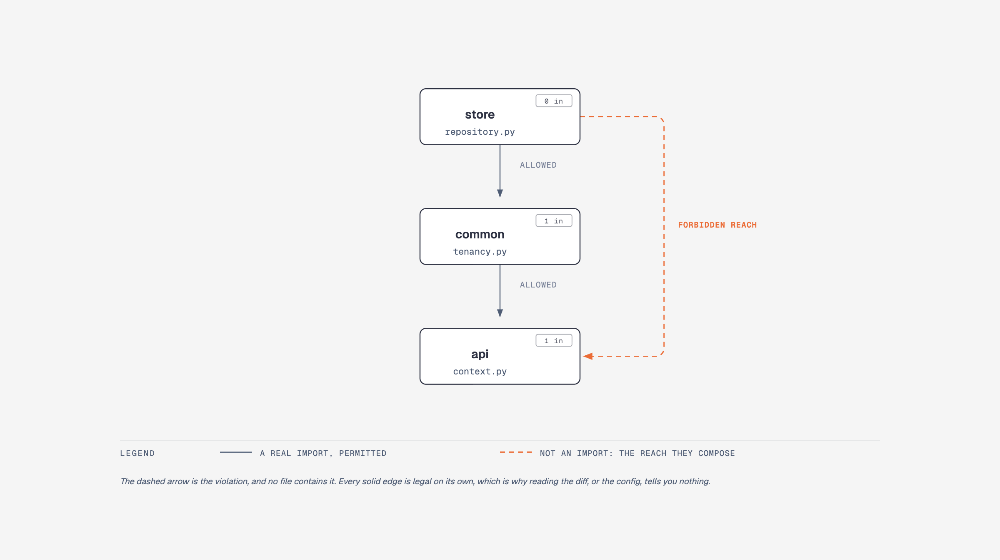

# An agent broke the architecture. Here is what caught it, and what didn't.

```bash
uv run python bench/walkthrough.py
```

One command, no setup, about a second. It builds a small layered project, applies a
plausible agent edit, and runs four archy surfaces against the result. Three of
them miss the regression. One catches it.

This page explains why that ratio is the honest headline.

## What this is not

It is not a benchmark, and it makes no claim that archy makes an agent cheaper,
faster, or more correct.

archy tried to measure exactly that, twice, and got nulls both times:
[#282](https://github.com/hslee16/archy/issues/282) found agent token footprint
moved 4,213 tokens the *wrong* way, and
[#289](https://github.com/hslee16/archy/issues/289) found reads-before-first-edit
at a median of -2.0 with p=0.286, a hint at N=10 that disappeared at N=22.
`RESEARCH_METRICS.md` §14c.7 records the resulting rule: an archy-specific
token-savings claim is not citable. This walkthrough respects that.

What it shows is narrower and checkable: **a specific structural regression, and
which surfaces report it.**

## The counterargument this has to answer first

archy's own docs record the strongest argument against it. From
[`docs/FUTURE.md`](FUTURE.md):

> Empirical finding from the agent-loop test in `governingdocs/backend`
> (2026-05): a fresh agent caught a forbidden cross-layer import before
> implementing it, but did so by reading `archy.yaml` + `CLAUDE.md` directly
> rather than calling `archy_check` / `archy_contracts`. The MCP-tool angle's
> marginal value over "agent reads docs" is narrower than the hypothesis
> assumed.

If the agent reads your rules file and obeys it, archy adds nothing. That is a
real result on a real codebase, and any walkthrough that quietly picks an edit
where reading the config *would* have worked is selling something.

The same entry names the case where reading is not enough: **"when violations
are transitive multi-hop."** That is what this walkthrough is built on. Not
because it flatters archy, but because it is the only part of the claim the
2026-05 result left standing.

## The setup

A four-layer project. The intended direction is `api -> service -> store`, and
`common` is a shared helper layer that is **deliberately allowed** to read API
request context. That permission is the load-bearing detail.

```yaml
forbid:
  - {from: store, to: api}      # a persisted row must not depend on how the
  - {from: store, to: service}  # request happened to arrive
  - {from: service, to: api}
```

Baseline: `archy check` passes, `archy contracts` passes, no cycles.

## The edit

The task: *stamp the tenant on each saved order.*

```diff
--- a/shipping/store/repository.py
+++ b/shipping/store/repository.py
+from shipping.common.tenancy import tenant_or_default
     _ROWS.append({"id": oid, "sku": sku, "qty": qty,
+                  "tenant": tenant_or_default()})
```

This is a reasonable edit. The helper already exists. It lives in `common`,
which `store` is allowed to import. There is no rule against it.

**Nothing in this diff mentions `api`.** An agent that reads `archy.yaml`
before editing finds no rule that this breaks, because at the file level, it
doesn't break one. Reading the config is genuinely not enough here, which is
the whole point.

But `shipping.common.tenancy` already imports `shipping.api.context`. So the
store now reaches the api layer, two hops out.



The dashed arrow is the thing the rules forbid, and it is the one arrow no
file contains.

## The result

| Surface | Result | Why |
|---|---|---|
| `archy check` | **misses it**, exit 0 | direct edges only; no file imports `api` from `store` |
| `archy cycles` | misses it | this is not a cycle |
| `archy dsm --group topological` | misses it | a forward edge crossing a forbidden boundary is not a back-edge, so no cell flags |
| `archy contracts` | **catches it**, exit 1 | transitive, via import-linter |

```console
$ archy contracts .
# contracts: 1 kept, 2 broken (10 modules, 4 imports)
X  store layer must not reach api layer  [ForbiddenContract]
    shipping.store -> shipping.api
      via shipping.store.repository -> shipping.common.tenancy -> shipping.api.context
OK store layer must not reach service layer  [ForbiddenContract]
X  service layer must not reach api layer  [ForbiddenContract]
    shipping.service -> shipping.api
      via shipping.service.orders -> shipping.store.repository -> shipping.common.tenancy -> shipping.api.context
[exit 1]
```

**The second violation is the actual argument.** The agent edited one file in
`store`. It also broke `service -> api`, three hops out, through
`service/orders.py`, a module the edit never opened and the author never looked
at. Finding that by reading means holding the whole import graph in your head,
which is precisely the thing that stops being possible as a codebase grows.

## Where archy adds nothing

Stated plainly, because #326 requires it and because the table above already
gives most of it away:

- **If the rule is broken by a direct import, reading `archy.yaml` is enough.**
  The 2026-05 `governingdocs/backend` result stands. A capable agent with the
  config in context will catch that case without calling a tool, and archy's
  contribution is determinism, not capability.
- **Three of archy's four structural surfaces miss this regression.** `check`,
  `cycles`, and `dsm` are the wrong instruments for a transitive layer breach.
  Only `contracts` catches it. If you install archy and run `archy check` in CI
  expecting it to enforce your layer rules transitively, it will not.
- **The score is not the signal here.** `archy diff` against a baseline reports
  `overall -0.017`, driven by modularity and depth moving as the graph reshapes.
  That number is real but it is not the violation, and reading it as one would
  be a mistake. Nothing about `-0.017` says "a layer rule broke."
- **This is a synthetic fixture**, generated by the script rather than a pinned
  third-party repo. The *shape* is taken from a real recorded case: the
  psycopg-through-db-engine indirection in `FUTURE.md`, where an edge exists
  only to route around a layer boundary. The code is not real, and it is not
  presented as evidence about real codebases. It is a reproduction of a
  mechanism.

## The honest summary

archy's value in this scenario is not that it is smarter than the agent. It is
that a transitive violation is invisible to reading, invisible to the diff, and
invisible to three of archy's own surfaces, and one command finds it along with
a second violation nobody was looking for.

That is a narrower claim than "archy makes agents write better code." It is
also one you can verify in five seconds.

## Notes

`archy contracts` needs the extra: `pip install 'archy[contracts]'`, or
`uvx --from 'archy[contracts]' archy contracts .`.

Deriving transitive contracts from `archy.yaml`'s `forbid:` rules is a
best-effort fallback and archy warns about it, because it cannot express
`ignore_imports` or whitelisted edges. A project with legitimate transitive
paths should add a `.importlinter` file, which is the canonical config.

`bench/walkthrough.py` asserts every outcome above. If archy's behavior changes
so that `check` starts catching this, or `contracts` stops, the script exits 1
rather than continuing to publish a claim that is no longer true.
